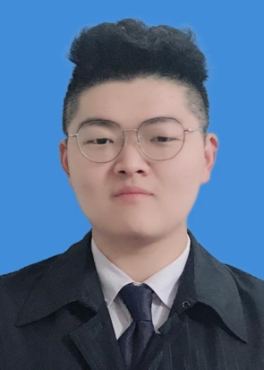

<table border="0">
  <tr>
    <td width="75%">
      <h1>Jiajun Fan</h1>
      
<b>Bachelor of Engineering</b>

      
<b>Nankai University Artificial Intelligence College</b>

      
<b>Email:jiajunfanthu@gmail.com</b>

      
<b>Tel:+86 17822018001</b>

        

           <a href="./resume_cn.html">Resume in Chinese</a>
        

    </td>
    <td width="25%" >
      
    </td>
  </tr>
</table>

## **EDUCATION **

***

**Nankai University Artificial Intelligence College**  													   **TianJin,China** 

*Bachelor of Engineering, major in Intelligent Science and Technology*                           *Sept. 2017 - Expected 2021*

-   **GPA** : 93.17/100 (1/47)
-   Relevant Coursework: Automatic Control Principle, Computer Composition Principle, Differential Equation and Complex Function, Probability Theory and Mathematical Statistics, Machine Vision, Data Structure, Reinforcement Learning(cs294), Machine Learning(cs229), Deep Learning (cs230)

## **PUBLICATIONS **

***

[1]**Fan Jiajun**, Ba He, Guo Xian, Hao Jianye.  Critic PI2:  Master Continuous Planning via Policy Improvement with Path Integrals and Deep Actor-Critic Reinforcement Learning. 2020

[2] Xiao  Changnan,  Shi  Haosen,  **Fan  Jiajun**,  Deng  Shihong.   CASA-B:  A  Unified  Framework  of Model-Free Reinforcement Learning. 2021.

## **Relevant EXPERIENCE **

***

**Reinforcement Learning Project Team Intern**

*Advisor:* **[Xian Guo](http://ai.nankai.edu.cn/info/1035/2825.htm) **

**Project A: Research on Model-based Reinforcement Learning Algorithm**       *Apr.2020 – persent*

-   Propose a new strategy to improve the algorithm learning framework and test the algorithm performance on the [MuJoCo](http://www.mujoco.org/) simulation environment                        **(Python)**
-   Project results will be submitted to  **AAAI 2021**

**Project B: Constrained Path Integral for Hypersonic Aircraft Attitude Control**       *Mar.2020 – Apr.2020*

-   Proposed multiple improvements to PI2 and solved a stochastic optimal control model with constraints 
-   Research results will be submitted to [**CAC 2020**](http://www.caa.org.cn/cac2020/)

**Project C: A Novel Hypersonic Aircraft Attitude Controller Based on Path Integral**   *Feb. 2020 – Mar.2020* 

-   Implemented a rolling optimization algorithm based on MPC control method             **(Python)**
-   Implemented PID system auto-tuning algorithm based on path integral             **(Python & C++)**
-   Research results have been submitted to  [**ICGNC 2020**](http://icgnc.buaa.edu.cn/)

**Project D: Gobangs robot based on ModelArts and HiLens**                *Sept. 2019 - present*

* The paper based on AlphaGo realizes Gobang AI, and combined with visual algorithm to realize automatic game AI                                     **(Python)**
* Related achievements will be showcased at the [2020 Robocup China](http://robocup.drct-caa.org.cn/index.php/)             

**Robot Development Project Team Intern**      

**Advisor:**[**Feng Duan**](https://ai.nankai.edu.cn/info/1032/2779.htm), **Jeffrey Too Chuan TAN**

**Project E : Multifunctional Home Service Robot**               *Sept. 2018 - Jul. 2019*

-   Proposed a solution for the entire project and a finite state machine diagram        **(Visio)**
-   Implemented autonomous navigation and RRT path planning related algorithms based on ROS **(C++ & Python)**
-   Project results have been presented in the[ 2019 ROBOCUP Sydney World Finals](https://2019.robocup.org/) 

## **AWARDS **

***

-   2018 Nankai University Public Scholarship (top 5%)
-   2018 Nankai ACM School Tournament Bronze
-   2018 National Second Prize of National College Students Mathematical Contest in Modeling (top 1%)
-   2019 third place in the EDU group of the Robocup World Robot Competition
-   2019 Xuzhou ACM / ICPC Bronze Medal
-   2019 National Scholarship (top 1%)

## WORK EXPERIENCE

* Director of Academic Department, School of Artificial Intelligence, Nankai University
* Intern in AI Lab  of Byte Dance 

